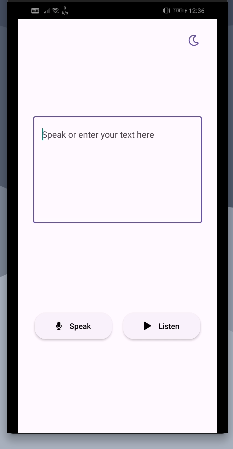
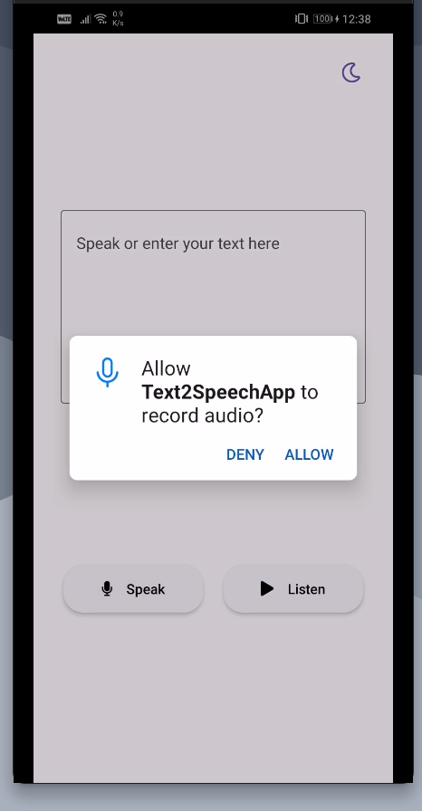
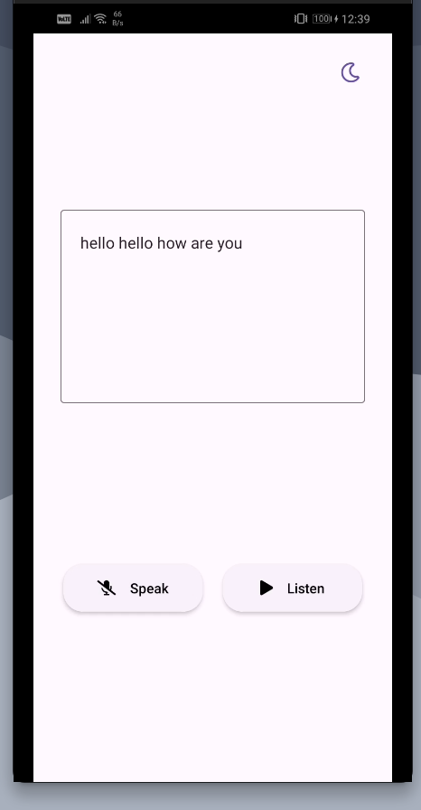
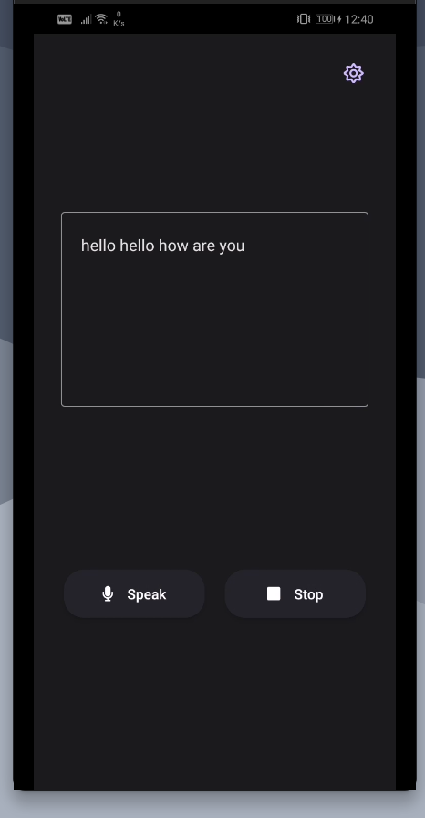

# Text to Speech App

### Features:

- You can speak or type text, speech to text is implemented using `react-native-voice` library.

- You can listen to the typed text. Listening feature is implemented using `react-native-tts` library.

- Dark mode, used `React Native Paper` material design library.

### Screenshots

- Main Screen:

  

- Granting Permission:

  

- Speaking (Speech to Text):

  

- Listening (Text to Speech) and Dark Mode:

  
